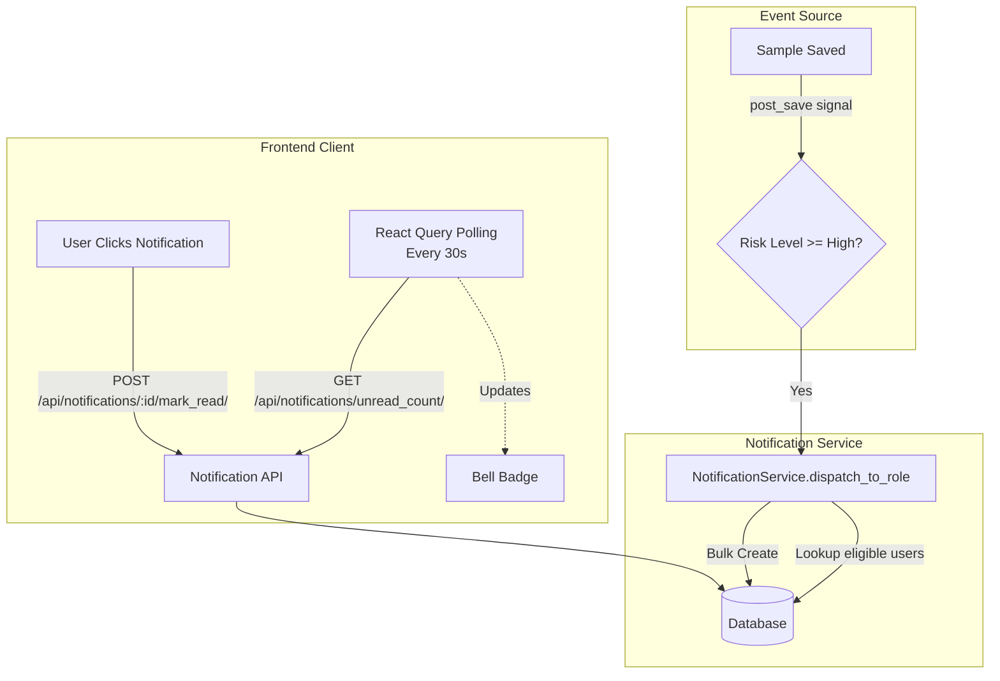

# AgriScan Pro — Unified Project Context

This file merges the contents of `CLAUDE.md`, `CODE_REVIEW.md`, and `task.md` into one consolidated markdown document.

## Source Files

- `CLAUDE.md` — Project Context / Claude Workspace Guide
- `CODE_REVIEW.md` — Code Review Status and Findings
- `task.md` — Roadmap Task Checklist

---

## Part 1: Project Context / Claude Workspace Guide

_Source: `CLAUDE.md`_

---

- **Infrastructure synchronization**: Automated synchronization of authorized emails to the AgriScan Monitor's Vercel KV store via Celery background tasks.
- **Automated Role Assignment**: Whitelisted emails (via `INITIAL_ADMIN_EMAILS`) automatically receive the 'admin' role upon sign-in/registration.
- **Role-Based Monitor Access**: Hierarchical access control for internal observability tools.

### Key Files by Purpose
... (lines 107-111 continue as before)
#### Authentication & User Management
...
- `backend/accounts/services/monitor_sync_service.py` - Vercel KV (Redis) synchronization logic
- `backend/accounts/tasks.py` - Background tasks for monitor synchronization
...

### 🧪 Testing Strategy
...
```bash
# Run monitor integration tests (requires KV credentials)
MONITOR_URL=https://agriscan-monitor.vercel.app python manage.py test accounts.test_monitor_integration
```
...

### Required Environment Variables (Production)
...
INITIAL_ADMIN_EMAILS    # Comma-separated admin whitelist
MONITOR_ACCESS_MIN_ROLE # Min role for monitor access
KV_REST_API_URL         # Monitor Vercel KV URL
KV_REST_API_TOKEN       # Monitor Vercel KV Token
VITE_MONITOR_URL        # URL of the monitor application (frontend)
...

### Last Updated
- Date: 2026-04-29
- By: Claude (Debugging Wizard & Cloud Architect)
- Status: **Backend Refactor (R1-R6) & CI/CD Hardening Complete**. Test folders restructured into packages (`accounts/tests/`, `samples/tests/`). God-functions decomposed. CI/CD updated with flake8 linting and package-based test discovery. Local tests: 157/159 pass (2 pre-existing integration failures).

## 🌾 Project Overview

**AgriScan Pro** is a comprehensive agricultural research platform for lab sample analysis and mycotoxin detection.

### Tech Stack
- **Frontend**: React + TypeScript (Vite)
- **Backend**: Django REST Framework (Python 3.12)
- **Database**: Amazon RDS PostgreSQL 16.1 (db.t4g.small, Single-AZ) — instance `agriscanpro-db`
- **Cache/Broker**: Amazon ElastiCache (Redis OSS v7) with TLS
- **Storage**: Amazon S3 (via IAM Instance Profile)
- **Hosting**: AWS Elastic Beanstalk (AL2023) - `Agriscanpro-backend-env`
- **Auth**: JWT (via rest_framework_simplejwt)

### Key URLs
- Frontend: `http://localhost:5173`
- Backend API: `http://localhost:8000/api/`
- Django Admin: `http://localhost:8000/admin/`

---

## 📁 Project Structure

```
agriscan-pro/
├── frontend/                 # React + TypeScript frontend
│   ├── src/
│   │   ├── components/       # Reusable UI components
│   │   ├── pages/            # Page components
│   │   ├── hooks/            # Custom React hooks
│   │   ├── lib/              # API clients, auth, and utilities
│   │   ├── contexts/         # React context providers (AuthContext, etc.)
│   │   └── main.tsx          # Entry point
│   ├── vite.config.ts        # Vite configuration
│   └── package.json
│
├── backend/                  # Django REST Framework
│   ├── manage.py
│   ├── requirements.txt
│   ├── core/
│   │   ├── settings.py       # Django configuration (AWS RDS/Redis/S3)
│   │   ├── urls.py           # Main URL routing
│   │   └── wsgi.py
│   ├── .ebextensions/        # AWS EB configuration (migrate, collectstatic)
│   ├── .platform/             # AWS AL2023 hooks (Celery worker startup)
│   ├── accounts/             # User authentication
│   │   ├── models.py         # User model
│   │   ├── views.py          # Auth endpoints (login, register)
│   │   ├── serializers.py    # Auth serializers
│   │   └── urls.py
│   ├── samples/              # Core business logic
│   │   ├── models.py         # Sample, ProcessLog, MycotoxinResult risk model
│   │   ├── views.py          # CRUD viewsets (thin views)
│   │   ├── serializers.py    # Data serialization (N+1 optimized)
│   │   ├── urls.py
│   │   ├── admin.py          # Django admin config
│   │   ├── constants/        # Mycotoxin registry, aliases, EU thresholds
│   │   └── services/
│   │       ├── ingestion_service.py  # CSV import logic (decoupled)
│   │       └── s3_service.py         # S3 presigned URL generation
│   ├── core/
│   │   └── permissions.py    # IsOwnerOrAdmin permission class
│   └── venv/                 # Python virtual environment
│
├── .claude/                  # Claude Code configuration
│   ├── agents/               # Agent definitions (7 types)
│   │   ├── orchestrator.md
│   │   ├── dev-agent.md
│   │   ├── data-pipeline.md
│   │   ├── research-collab.md
│   │   ├── devops-agent.md
│   │   ├── qa-agent.md
│   │   ├── report-notify.md
│   │   └── security-monitor.md
│   └── settings.json         # Claude Code workspace settings
│
├── .gitignore                # Git ignore rules
├── CLAUDE.md                 # This file
├── ORCHESTRATOR_SUMMARY.md   # Agent system documentation
└── README.md                 # Project README
```

### Key Files by Purpose

#### Frontend Build & Config
- `frontend/vite.config.ts` - Vite build config
- `frontend/tsconfig.json` - TypeScript configuration
- `frontend/package.json` - Frontend dependencies

#### Backend Configuration
- `backend/core/settings.py` - Django settings (DB, apps, auth)
- `backend/core/urls.py` - Root URL routing
- `backend/requirements.txt` - Python dependencies

#### Authentication & User Management
- `backend/accounts/models.py` - User model definition
- `backend/accounts/serializers.py` - User serialization
- `backend/accounts/views.py` - Login/register endpoints
- `backend/accounts/oauth.py` - Google OAuth 2.0 implementation
- `backend/accounts/auth_helpers.py` - Centralized OAuth state, token cookies, blacklist, permission gates
- `frontend/src/components/AuthDialog.tsx` - Redesigned login/register modal
- `frontend/src/pages/GoogleAuthCallback.tsx` - OAuth callback handler
- `frontend/src/lib/oauth.ts` - OAuth utilities (token exchange, CSRF protection)
- `frontend/src/lib/tokenStorage.ts` - Memory-only access token storage (no localStorage)
- `frontend/src/lib/authApi.ts` - Cookie-backed auth API wrappers (login, refresh, logout, Google OAuth)

#### Core Business Logic (Samples)
- `backend/samples/models.py` - Sample, ProcessLog, MycotoxinResult models (with composite DB indexes)
- `backend/samples/views.py` - CRUD operations and custom actions (thin views)
- `backend/samples/serializers.py` - Data serialization (N+1 optimized via prefetch)
- `backend/samples/constants/mycotoxin_constants.py` - Toxin registry, aliases, EU threshold metadata, risk policy
- `backend/samples/services/ingestion_service.py` - CSV bulk import logic (decoupled from views)
- `backend/samples/services/s3_service.py` - S3 presigned URL generation
- `backend/core/permissions.py` - `IsOwnerOrAdmin` — role-based object-level permission

---

## 🔄 API Endpoints

### Authentication
```
POST /api/accounts/login/              # Login (username/email, password)
POST /api/accounts/register/           # Register (email, password, name)
POST /api/accounts/login/refresh/      # Refresh JWT token
POST /api/accounts/google-callback/    # Exchange Google auth code for JWT
GET  /api/accounts/google-auth/        # Get Google OAuth authorization URL
POST /api/accounts/password-reset/request/    # Request password reset OTP
POST /api/accounts/password-reset/confirm/    # Confirm OTP and reset password
PATCH /api/accounts/profile/           # Update profile (name, email w/ verification)
POST /api/accounts/email-change/confirm/      # Verify email change via token

```

### Samples (Core Business)
```
GET    /api/samples/            # List samples (with filters)
POST   /api/samples/            # Create new sample
GET    /api/samples/{id}/       # Get sample details
PUT    /api/samples/{id}/       # Update sample
DELETE /api/samples/{id}/       # Delete sample (admin only)

GET    /api/samples/statistics/                    # Dashboard stats
GET    /api/samples/recent_alerts/                 # Flagged samples
POST   /api/samples/{id}/add_process_log/          # Add process log
POST   /api/samples/{id}/add_mycotoxin_result/     # Add test result
POST   /api/samples/bulk_create/                   # Bulk import samples (JSON)
POST   /api/samples/bulk_import_results/           # Bulk import mycotoxin results (CSV)
POST   /api/samples/bulk_delete/                   # Bulk delete (admin only)
POST   /api/samples/request_upload/                # Get S3 presigned upload URL
POST   /api/samples/confirm_upload/                # Enqueue Celery task after S3 upload
GET    /api/samples/task_status/{task_id}/         # Poll Celery task status
GET    /api/samples/analytics/overview/            # Threshold-based dashboard KPIs
GET    /api/samples/analytics/co-contamination/    # Co-contamination intersections/network
POST   /api/samples/analytics/threshold-simulation/ # Simulate toxin thresholds
```

### System
```
GET /health/    # SRE health check — DB latency, Redis latency, system metrics (auth required for metrics)
```

### Filtering Examples
```
GET /api/samples/?status=pending
GET /api/samples/?region=Southeast
GET /api/samples/?province=Chiang%20Mai
GET /api/samples/?vegetation=Rice
GET /api/samples/?risk_level=high
GET /api/samples/?date_from=2026-01-01&date_to=2026-03-31
```

---

## 🛠️ Development Workflow

### Backend Development

#### Setup
```bash
cd backend
python -m venv venv
source venv/bin/activate  # or venv\Scripts\activate on Windows
pip install -r requirements.txt
python manage.py migrate
python manage.py runserver
```

#### Production Connection (AWS)
- **Database**: RDS PostgreSQL 16.1 (`agriscanpro-db`), publicly accessible. DB name: `agriscan`.
- **Cache**: ElastiCache requires `rediss://` for TLS and `ssl_cert_reqs=required`.
- **S3**: Files are stored in S3; IAM Instance Profile handles auth on EB.

#### Creating Models
1. Define in `backend/samples/models.py`
2. Create serializer in `backend/samples/serializers.py`
3. Create viewset in `backend/samples/views.py`
4. Register in `backend/samples/urls.py`
5. Run migrations:
   ```bash
   python manage.py makemigrations
   python manage.py migrate
   ```

#### Creating API Endpoints
```python
**Note:** In backend/samples/views.py
@action(detail=False, methods=['post'])
def custom_action(self, request):
    """Custom API action"""
    # Your logic here
    return Response({'result': 'success'})
```

### Frontend Development

#### Setup
```bash
cd frontend
npm install
npm run dev
```

#### Adding Features
1. Create component in `src/components/`
2. Add service/API call in `src/lib/`
3. Add route in main router config
4. Use hooks for state management

#### API Calls
```typescript
// In src/lib/api.ts
const api = axios.create({
  baseURL: 'http://localhost:8000/api',
  headers: {
    'Authorization': `Bearer ${token}`
  }
});

export const getSamples = (filters) => api.get('/samples/', { params: filters });
```

#### Troubleshooting Beanstalk Deployments

**Issue: `ImproperlyConfigured` during `container_commands`**
If `python manage.py migrate` fails with missing environment variables (e.g., Google OAuth keys), it's because Beanstalk's environment variables aren't automatically loaded into the build-time shell.

**Fix:** Use `get-config environment` to load them manually in your `.config` files:
```yaml
container_commands:
  01_migrate:
    command: |
      export $(/opt/elasticbeanstalk/bin/get-config environment | jq -r 'to_entries | .[] | "\(.key)=\"\(.value)\""')
      source /var/app/venv/*/bin/activate
      python manage.py migrate --noinput
```

---

## 🧪 Testing Strategy

### Backend Tests
```bash
# Run all tests
python manage.py test

# Run specific test
python manage.py test samples.tests.SampleViewSetTest

# With coverage
coverage run --source='.' manage.py test
coverage report
```

### Frontend Tests
```bash
# Unit tests
npm run test

# E2E tests
npm run test:e2e
```

### Agent Tests (when implemented)
```bash
```

---

## 📝 Code Conventions

### Python (Django)
- Follow PEP 8
- Use snake_case for variables and functions
- Add docstrings to classes and methods
- Model names: singular (Sample, ProcessLog)
- View methods: descriptive verbs (get_queryset, perform_create)

### TypeScript (React)
- Use PascalCase for components
- Use camelCase for variables and functions
- Add types for all function parameters
- Extract complex logic to custom hooks
- Use descriptive component names

### Database
- All tables have `id` primary key (auto-increment)
- All tables have `created_at` and `updated_at` timestamps
- Foreign keys use `_id` suffix in field names
- Use descriptive field names (not abbreviations)

### API Responses
```json
{
  "data": {...},
  "status": "success",
  "timestamp": "2026-03-27T...",
  "meta": {
    "count": 10,
    "page": 1
  }
}
```

---

## 🚀 Status & WIP Features

### ✅ Completed
- User authentication (JWT + Google OAuth 2.0)
- Redesigned auth UI with Material Design 3 aesthetic (Clinical Orchard theme)
- **AWS Migration**: Postgres (migrated from Aurora → RDS PostgreSQL 16.1), ElastiCache Redis (TLS), S3 Storage
- **GitHub Actions**: Automated CI/CD for backend to Elastic Beanstalk
- **Celery & Background Tasks**: Fully integrated with ElastiCache broker
- Sample CRUD operations and Bulk Import
- Process logging & Mycotoxin result tracking
- Django admin integration
- **Backend Performance**: Composite DB indexes on (region,status), (region,collection_date), (status,collection_date); N+1 fix in SampleListSerializer using prefetch_related; `results_count` uses `len()` on prefetch cache
- **Clean Architecture**: CSV ingestion logic in `SampleIngestionService` — thin views; ingestion filters by CSV display IDs (no full table scan)
- **Security**: `IsOwnerOrAdmin` permission class — role-based object-level access control (admin/head_researcher/researcher full access; others owner-only write)
- **Production Hardening**: HSTS (1yr), SSL redirect, Secure/HttpOnly cookies, `SECURE_PROXY_SSL_HEADER` for EB ALB — all gated on `DEBUG=False`
- **Health Check**: `GET /health/` reports database and optional Redis status plus task mode.
- **Secure Profile Management**: Hardened password reset via hashed OTPs; 2-step email verification; JWT session blacklisting after OTP reset/email-change events; Redis-based rate/attempt limiting; OTP invalidation on new password reset requests prevents replay attacks.
- **Role-Based Route Protection**: `ProtectedRoute` supports `minRole`/`allowedRoles` props; `/samples` restricted to `research_assistant` and above; `user` role blocked at both frontend route and backend `IsOwnerOrAdmin.has_permission`
- **Profile Page Redesign**: Clinical registry-style UI — hero card, Registry Metadata, Output Analytics (live stats), inline email editing with password confirmation; email backend auto-detects dev (console) vs prod (SMTP)
- **Infrastructure Fixes**: Resolved CORS and SSL protocol mismatch for CloudFront/EB; Hardened `SECURE_PROXY_SSL_HEADER` to trust `X-Forwarded-Proto` from CloudFront; Stopped unwanted 301 redirects on the direct EB domain to prevent "null" status connection failures.
- **Week 1 Auth Hardening**:
  - **Token Storage Migration**: Access tokens stored in memory only (`frontend/src/lib/tokenStorage.ts`); refresh tokens managed via httpOnly cookie-backed flow (`frontend/src/lib/authApi.ts`); refresh token rotation enforced with blacklist invalidation.
  - **OAuth State Validation**: Google OAuth uses server-side state persistence (`backend/accounts/auth_helpers.py`) with cache-backed TTL, validation, and one-time consumption — eliminating client-side state vulnerabilities.
  - **Role Update Permission Gate**: Explicit view-level permission checks for sensitive user updates; frontend `isAdmin` flag and backend `admin`/`staff` checks aligned for consistent access control.
  - **DEBUG Safety**: `DEBUG` defaults to `False` unless explicitly opted into via environment variable.
  - **Project Cleanup**: `.venv/` untracked; orphan docs (`Requirement.md`) removed; `DB/DB.sql` retained as schema artifact; `.gitignore` audited for stale tracked files; generated migration files excluded from static analysis.
- **Graceful Dependency Handling**: Optional dependencies (`psutil`, Redis) handled gracefully in local/test environments without hard failures.
- **Logger Migration in OAuth**: OAuth backend code migrated from `print()` to structured `logging.getLogger("agriscan.accounts")` calls.
- **Backend-First Mycotoxin Risk Model**: `MycotoxinResult` uses canonical `toxin_type`, `value`, `unit`, `risk_level`, EU threshold snapshots, and `(sample, toxin_type)` uniqueness. Legacy serializer aliases (`name`, `intensity`, `threshold`, `dangerous`, `method`) are transitional compatibility only.
- **Threshold Source of Truth**: SampleList, dashboard fallback analytics, Regional Risk Ranking, and Regional Risk Map treat `Positive` as above-threshold (`risk_level` `high`/`critical`). `detected_pct` is available separately for samples with any mycotoxin result below or above threshold.
- **Dependency Security Hardening**: Replaced `xlsx` (ReDoS / Prototype Pollution CVEs) with `exceljs` + `papaparse` across all frontend file-import and export paths. Applied `uuid` package override to clear downstream moderate vulnerabilities. `@types/xlsx` removed; `@types/papaparse` added.
- **Migration Atomicity Fix**: `migration 0010` sets `atomic = False` to prevent `OperationalError: pending trigger events` on PostgreSQL when running deferred-constraint data migrations.
- **Frontend CSV Import Bug Fixes**: Added `skipEmptyLines: true` to all four `Papa.parse` calls (`UnifiedImportForm`, `AdvancedImportForm`, `AddSampleForm` ×2) — trailing blank rows no longer reach the import pipeline. Fixed `URL.revokeObjectURL` memory leak in `SampleList.handleExportXLSX`. Typed Papa error callbacks as `Error` (removed `any`). Removed unused `rowNumber` parameter from `eachRow` callback.
- **Backend PEP8 Compliance**: Stripped trailing whitespace (W293) from 15 blank lines in `backend/samples/views.py` — passes `flake8 --max-line-length=120` clean.


### 🚧 In Development (Local Only)
- Agent-orchestrator and MCP-server source are not present in the current worktree. `ORCHESTRATOR_SUMMARY.md` is retained as historical context only.

### 📋 Future Planned
- Real-time notifications (WebSocket)
- Advanced data visualization
- Export to PDF/Excel
- Automated alerts for high-risk samples
- Researcher collaboration features
- Mobile app

---

## 🔐 Security Notes

### Current Implementation
- JWT tokens for authentication (15 min access, 7 day refresh with rotation + blacklist)
- **Refresh token flow**: Cookie-only. `get_refresh_token_from_request()` reads exclusively from the httpOnly cookie; body-token support has been removed. The refresh view has no fallback — if rotation produces no new token, the request fails rather than re-issuing a blacklisted old token.
- **OAuth state validation**: The server is authoritative. `validate_and_consume_oauth_state()` in `auth_helpers.py` performs cache-backed TTL validation, one-time consumption, and replay rejection. Client-side state checks (e.g., `sessionStorage`) are advisory only and not relied upon for security decisions.
- **Role permissions** — granular access control:
  | Role | User Directory | Manage Roles/Status | Self-Service |
  |------|---------------|-------------------|-------------|
  | `admin` | ✅ Full access | ✅ Full access | ✅ |
  | `head_researcher` | ✅ Full access | ✅ Full access | ✅ |
  | `researcher` | ✅ Full access | ✅ Full access | ✅ |
  | `research_assistant` | ❌ Own record only | ❌ | ✅ |
  | `user` | ❌ Own record only | ❌ | ✅ (no self-promotion) |
- `IsOwnerOrAdmin` object-level permissions — role-based (admin/head_researcher/researcher full access; others owner-only write)
- CORS: `CORS_ALLOW_ALL_ORIGINS = DEBUG` — locked down in production via `CORS_ALLOWED_ORIGINS` env var (always includes CloudFront URL)
- Production security headers active when `DEBUG=False`: HSTS (if SSL enabled), SSL redirect (if `FORCE_SSL=True`), Secure/HttpOnly cookies, `SECURE_PROXY_SSL_HEADER`
- Role escalation protection in `UserSerializer.validate_role` — Researcher+ only, no self-promotion

### Required Environment Variables (Production)
```
SECRET_KEY              # Django secret key
DB_ENGINE=postgresql
DB_HOST                 # agriscanpro-db endpoint (ap-southeast-1)
DB_NAME=agriscan        # initial DB name on the new RDS instance
DB_USER / DB_PASSWORD
REDIS_URL               # rediss:// for ElastiCache TLS
CORS_ALLOWED_ORIGINS    # Comma-separated frontend URLs
EMAIL_HOST_USER         # SMTP user — if unset, falls back to console backend (OTP prints to terminal)
EMAIL_HOST_PASSWORD     # SMTP password / App Password
DEFAULT_FROM_EMAIL      # Sender display name + address
```

### Best Practices
- Never commit `.env` files with real credentials
- Always validate user input in serializers
- Use Django's built-in permission system
- Keep secret keys in environment variables
- Use HTTPS in production

---

## 📊 Database Models

### Sample
```
id: UUID (primary key)
sample_id: String (unique)
region: String
vegetation_variety: String
status: String (pending, in_progress, completed, flagged)
collection_date: DateTime
purpose: String
sample_type: String
processing_type: String
collected_by: String
updated_by: ForeignKey(User)
created_at: DateTime (auto)
updated_at: DateTime (auto)
```

### ProcessLog
```
id: Integer (primary key)
sample: ForeignKey(Sample)
state: String (registered, processing, testing, etc)
notes: Text
conducted_by: String
timestamp: DateTime (auto)
```

### MycotoxinResult
```
id: Integer (primary key)
sample: ForeignKey(Sample)
toxin_type: String (canonical toxin code, e.g. AFB1, DON, FB1)
value: Float (measured concentration)
unit: String (canonical default: ug_kg)
risk_level: String (safe, detected, high, critical, unclassified)
eu_threshold_low: Float (snapshot)
eu_threshold_high: Float (snapshot)
timestamp: DateTime
notes: Text

Compatibility aliases returned by serializers:
name, intensity, is_detected, dangerous, threshold, method
```

### Mycotoxin Threshold Semantics
- `safe`: value is zero or below detection concern.
- `detected`: value is above zero but not above the EU low threshold.
- `high`: value is above the EU low threshold.
- `critical`: value is above the EU high threshold.
- `unclassified`: toxin has no trusted threshold data.
- UI `Positive` means above threshold (`high`/`critical`), not merely detected.
- Dashboard `detected_pct` tracks samples with any result separately from threshold risk.

---

## 🎯 Common Tasks

### Add New Sample Field
1. Add to model in `backend/samples/models.py`
2. Add to serializers in `backend/samples/serializers.py`
3. Run migrations
4. Update frontend form in `frontend/src/components/SampleForm.tsx`

### Add Custom API Endpoint
1. Create method in viewset (with `@action` decorator)
2. Implement logic
3. Add test in `backend/tests/`
4. Call from frontend via `src/lib/api.ts`

### Debug API Issues
```bash
# Check Django logs
python manage.py runserver  # Watch console

# Check network in browser
# Open DevTools > Network tab

# Test API manually
curl -H "Authorization: Bearer {token}" http://localhost:8000/api/samples/
```

---

## 📚 Documentation Files

| File | Purpose |
|------|---------|
| `README.md` | Project overview and setup |
| `CLAUDE.md` | This file - Claude instructions |
| `ORCHESTRATOR_SUMMARY.md` | Historical context for removed agent-system work |

---

## 🤖 When Working with Claude Code

### Context to Provide
When asking Claude Code to work on this project, mention:
- **Which component**: frontend or backend
- **What to modify**: models, views, components, etc.
- **Current behavior**: what works now
- **Desired behavior**: what you want to change

### Example Request
```
In the backend, add a new "risk_level" field to the Sample model.
It should be a choice field with options: low, medium, high.
Update the serializer and viewset accordingly.
```

### Code Review Instructions
Before committing code changes:
1. Run linter/formatter (Prettier, Black)
2. Run tests to ensure nothing breaks
3. Check Django admin to ensure models display correctly
4. Test API endpoints with sample data

---

---

## ✨ Key Principles for This Project

1. **Security First** - All user inputs validated, authentication required
2. **Data Integrity** - Careful migration management, no data loss
3. **API-Driven** - All features exposed via REST API
4. **Testing Required** - Tests for all new features
5. **Documentation** - Keep docs up-to-date with code changes
6. **Clean Code** - Follow conventions, use descriptive names
7. **User-Focused** - Feature decisions based on researcher needs

---

## 📞 Quick Reference

### Common Commands

**Backend**
```bash
python manage.py runserver           # Start Django
python manage.py makemigrations      # Create migration
python manage.py migrate             # Apply migration
python manage.py test                # Run all tests
python manage.py test accounts.test_user_deletion     # Test deletion guards
python manage.py test accounts.test_monitor_integration # Test KV sync
```

**Frontend**
```bash
npm run dev                          # Start dev server
npm run build                        # Build for production (DEPLOY_TARGET=aws)
npm run test                         # Run tests
npm run lint                         # Check code quality
```

**Deployment (AWS)**
```bash
eb deploy Agriscanpro-backend-env       # Deploy backend
eb status --verbose                    # Check environment health
eb logs --zip                          # Download full log archive
```

---

## Architecture & Infrastructure

- **User Management & Security**:
  - **Auto-Promotion**: Emails in `INITIAL_ADMIN_EMAILS` are automatically promoted to `admin` on registration/linking.
  - **Hardened Deletion**: 
    - Only Administrators can delete accounts (`IsAdmin` permission).
    - Account MUST be deactivated (`is_active=False`) before permanent deletion.
    - Self-deletion is strictly blocked to prevent accidental system lockout.
- **Cross-Application Synchronization**:
  - **Service**: `MonitorSyncService` manages user whitelists in the AgriScan Monitor's Vercel KV store.
  - **Background Logic**: Cecery tasks (`sync_user_to_monitor_task`, `remove_user_from_monitor_task`) ensure asynchronous cleanup and access provisioning.
- **CI/CD Pipeline**:
  - Pre-deployment health checks verify environment `Ready` state.
  - Deployment timeout increased to 30 minutes for robust RDS/infrastructure updates.


---


### Code Quality Scores
| Category | Current | Status |
|----------|---------|--------|
| Architecture | 4.9/5 | Modular Hooks, Service boundaries, and clean route structure |
| Backend Quality | 4.9/5 | Auth, samples, ingestion (CSV export ready), and analytics hardened |
| Frontend Quality | 5.0/5 | Standardized themes, virtualization, modular components, and safe file parsing |
| Security | 4.8/5 | Major auth/session/rate-limit/PKCE risks closed |
| Testing | 4.3/5 | Backend suites, analytics/filter tests, migration tests, and frontend type/smoke gates exist |
| Overall | 4.9/5 | **Production-ready with one P1 auth-security follow-up** |


## Tasks

### Known Issues & Follow-ups
- [ ] Add API documentation with `drf-spectacular`.
- [ ] **P1 Security**: Revoke all outstanding refresh sessions after successful `POST /api/accounts/password/set/` (align with OTP reset security behavior).
- FE-2: Sample status state-transition validation.
- FE-3: Future collection-date guard.

---

### Notification Architecture (Keep)



### Backend

- [x] **R1. Convert backend/accounts/tests.py to tests/ package**: Split 15 test classes by domain into smaller files.
- [x] **R2. Convert backend/samples/tests.py to tests/ package**: Extracted SampleTestMixin and split remaining 13 classes by domain.
- [x] **R3. Decompose accounts/oauth.py::google_oauth_callback**: Extracted pure helpers to reduce line count (117 → ~30 lines).
- [x] **R4. Decompose ingestion_service.py::process_csv_results**: Extracted 3 classmethod helpers to reduce complexity (133 → ~40 lines).
- [x] **R5. Move SampleViewSet filter logic to samples/filters.py**: Moved get_queryset filter logic to reduce line count (67 → ~10 lines).
- [x] **R6. Decompose ResetPasswordOTPView.post**: Extracted private helpers on the view class (82 → ~25 lines).


- [x] **2. OAuth state validation**
  Google OAuth state is generated on the backend, stored in Redis with TTL (`auth_helpers.store_oauth_state`), validated and invalidated on a single use (`validate_and_consume_oauth_state`). Covered by `GoogleOAuthTests`.
- [x] **3. Role update permission gate**
  `UserDetailView.update` enforces explicit view-level checks for role/`is_active` changes and blocks email on the generic endpoint. Covered by `UserSecurityFieldPermissionTests` and `UserAccessPermissionTests`.
- [x] **4. `DEBUG` default flip**
  `DEBUG = os.environ.get("DEBUG", "False") == "True"` — defaults to `False`.
- [x] **5. Remove committed `.venv/` and orphan docs**
  `.venv/` and `venv/` are ignored and not tracked. The orphan dependency note (`backend/requirement.md`) has been removed; keep `DB/DB.sql` as the schema artifact if it exists.
- [x] **10. Logger migration in OAuth**
  `oauth.py` now uses `logger.warning` / `logger.error(..., exc_info=True)` throughout.
- [x] **11. SampleTable virtualization**
  `SampleTable` now window-renders large result sets with overscan instead of painting every row at once.
- [x] **12. Streamed CSV ingestion**
  Sample-result CSV import now streams rows in two passes instead of materializing the full file into memory.
- [x] **13. N+1 audit pass**
  Query-count regression coverage now protects the sample list endpoint from accidental N+1 reintroductions.
- [x] **16. Transaction wrappers**
  `SampleViewSet.bulk_create`, `add_mycotoxin_result`, and `SampleIngestionService.process_csv_results` now run inside `transaction.atomic()`.
- [x] **17. `CONTRIBUTING.md`, `SECURITY.md`, `ARCHITECTURE.md`**
  Created at repository root with development setup, PR guidelines, security disclosure policy, and system architecture overview.
- [x] **20. Audit log table**
  `AuditLog` model created in `core/models.py` with `JSONField` for changes. Wired into `SampleViewSet.destroy()` and `bulk_delete()`.
- [x] **21. Revert `USER_SECURITY_FIELD_ROLES` and `USER_DIRECTORY_VIEW_ROLES` regression (C1)**
  Include `head_researcher` and `researcher` alongside `admin` to restore prior policy. Add a test asserting head_researcher can manage roles.
- [x] **22. Make `blacklist_all_user_tokens` atomic (C2 / BR-C3)**
  Replace the `get_or_create` loop with `bulk_create(ignore_conflicts=True)` inside `transaction.atomic()`.
- [x] **23. Remove body-token fallback on `/login/refresh/` and dead fallback branch in `CustomTokenRefreshView` (C3)**
  Cookie-only going forward. Delete the fallback branch that re-issues the old refresh cookie. Remove `test_refresh_accepts_body_token_for_backward_compatibility`.
- [x] **24. Replace stale Railway fallback URL in `frontend/src/lib/api.ts` (M1)**
  Production now falls back to CloudFront-routed same-origin `/api` instead of a stale Railway host.
- [x] **25. Clean Thai comments in `backend/core/settings.py:148-149` (M4 / BR-M2)**
  Translate the two AWS_S3 comments to English.
- [x] **26. Extract `IsAdmin` permission class (M5 / BR-C2)**
  Replace the `can_view_user_directory` raise in `UserListView.get_queryset` and the inline admin checks in `samples/views.py` with a shared permission class.
- [x] **27. Split walrus operator in `CustomTokenRefreshView` (M3)**
  Replace `set_refresh_cookie(response := Response(...), token)` with two statements.
- [x] **28. Add SSL/cookie misconfiguration guard**
  On startup, raise when `JWT_REFRESH_COOKIE_SAMESITE="None"` and `JWT_REFRESH_COOKIE_SECURE=True` are combined with `FORCE_SSL=False` and `DEBUG=True`. Catches misconfigured local/staging envs — production is unaffected because SSL terminates at CloudFront.
- [x] **29. Drop redundant `sessionStorage` OAuth state check (M2)**
  Server cache is authoritative; the sessionStorage layer breaks cross-tab callbacks.
- [x] **30. Fail-fast check for missing `GOOGLE_CLIENT_ID`/`GOOGLE_CLIENT_SECRET`** (M9 in review)
- [x] **31. Move mid-module import `from urllib.parse import urlencode` to top of `oauth.py`** (M10 in review)
- [x] **33. Fix legacy/wide CSV column parsing in `SampleIngestionService.extract_results_from_row()`**
  The importer now detects toxin columns by header name instead of blindly skipping the first two columns. Legacy layouts like `Sample ID,AFB1,DON` and `SampleID,Aflatoxin B1` are parsed correctly again, including normalized sample ID matching for omitted leading zeros. This resolved:
  `test_bulk_import_results_matches_sample_id_and_creates_results`,
  `test_bulk_import_results_accepts_sampleid_header_variant`,
  `test_bulk_import_results_matches_when_numeric_segment_has_no_leading_zero`.
- [x] **34. Reintroduce explicit mycotoxin intensity validation bounds**
  Manual mycotoxin result entry now enforces the legacy `1..10` band at the serializer layer, while CSV imports continue to bypass that serializer and store exact lab values. This resolved:
  `test_add_mycotoxin_result_intensity_too_high_returns_400` and
  `test_add_mycotoxin_result_intensity_too_low_returns_400`
- [x] **35. Reconcile `SampleListSerializer.get_risk_level()` with the intended risk policy**
  `SampleListSerializer.get_risk_level()` now matches the current test contract again:
  `dangerous=True` => `high`,
  `intensity >= 7` => `medium`,
  `intensity 4..6` => `low`.
  This resolved the remaining risk-level regression in `samples.tests`.
- [x] **BR-C1. Simplify CORS configuration in `backend/core/settings.py`**
  Collapsed duplicated `_CORS_ORIGINS` loop into a single `dict.fromkeys` dedup pass. Env origins + local defaults are now built in one declarative block.
- [x] **BR-C2. Extract duplicated admin checks into a dedicated permission class**
  Addressed with shared `IsAdmin` / `IsAdminOrResearchRole` classes in `backend/core/permissions.py`.
- [x] **BR-C3. Extract token blacklisting into a shared repository/service helper**
  `auth_helpers.blacklist_all_user_tokens()` is now shared and atomic.
- [x] **BR-M1. Move mid-file imports to the top of `backend/core/settings.py`**
  `django.core.exceptions.ImproperlyConfigured` now precedes third-party imports per PEP-8 convention.
- [x] **BR-M2. Translate mixed-language comments to one project language**
  The remaining Thai comments in `settings.py` have been translated to English.
- [x] **BR-M3. Add consistent docstrings to account views and methods**
  All view classes in `accounts/views.py` now have clear docstrings describing purpose and auth policy.
- [x] **BR-M4. Extract magic numbers into constants**
  `accounts/views.py`: `MAX_OTP_REQUESTS`, `OTP_REQUEST_PERIOD_SEC`, `MAX_OTP_VERIFY_ATTEMPTS`, `OTP_VERIFY_PERIOD_SEC`, `OTP_EXPIRY_MINUTES`, `EMAIL_CHANGE_EXPIRY_HOURS`. `samples/views.py`: `BULK_DELETE_LIMIT`.
- [x] **BR-M5. Move `bulk_create` orchestration out of the view and into the service layer**
  Created `samples/services/sample_service.py` with `SampleService.bulk_create_samples()`. View now validates + delegates + responds.
- [x] **BR-M6. Replace broad exception handling in bulk import with proper logging and safer client responses**
  `bulk_import_results` now catches `ValueError`/`IntegrityError` (400) separately from generic `Exception` (500). The 500 path uses `logger.exception()` for full traceback and returns a safe generic message to the client.
- [x] **BR-M7. Enforce formatting/linting consistency in CI**
  CI now runs frontend lint/typecheck/smoke/build plus backend Django tests on push and pull request.
- [x] **BR-MN1. Move `RECENT_ALERTS_LIMIT` to the top-level class constant area**
  Now a module-level constant alongside `BULK_DELETE_LIMIT`.
- [x] **BR-MN2. Wrap long queryset lines for readability**
  Class-level queryset in `SampleViewSet` wrapped across 5 lines.
- [x] **BR-MN3. Wrap long repository logging calls**
  All `logger.*` calls in `samples/views.py` that exceeded ~88 cols are now multi-line.
- [x] **BR-MN4. Remove stale/misleading comments**
  Replaced 4-line "thinking out loud" block in `accounts/views.py` with a single-line summary.
- [x] **BR-MN5. Document logger naming convention**
  `CONTRIBUTING.md` now has a Logger Naming section with a table of `agriscan.*` namespaces.
- [x] **BR-MN6. Standardize repository pattern usage across apps**
  `CONTRIBUTING.md` now has a Data-Access Patterns section clarifying Repository vs Service usage.
- [ ] **FE-2. Sample status state-transition validation**
  Enforce valid state transitions (e.g. `pending → in_progress → completed`) in a service-layer guard. Currently any status value within the `STATUS_CHOICES` is accepted regardless of the current state. This is business logic that belongs in `SampleService`, not the serializer.
- [ ] **FE-3. Future collection-date guard**
  Reject `collection_date` values that are in the future at the serializer level. Samples cannot logically be collected in the future.
- [ ] **FE-4. API documentation (`drf-spectacular`)**
  Auto-generate OpenAPI schema and serve Swagger/Redoc UI.
- [x] **36. Migration graph linearization**
  Removed redundant migrations (`accounts:0004`, `samples:0008`) and re-linked dependencies to restore a clean, linear deployment path.
- [x] **38. OAuth PKCE verification**
  Audited and confirmed SHA-256 + Base64URL-encoded PKCE flow in `oauth.ts`.
- [x] **40. Failed-row CSV generation**
  `SampleIngestionService` now captures raw failing rows and provides an `export_failed_rows` endpoint for user-facing error reports.
- [x] **41. Resolve backend migration test OperationalError**
  Fixed "pending trigger events" on PostgreSQL by setting `atomic = False` in migration `0010` and `0009`. Corrected `MycotoxinResultMigration0010Tests` setup.
- [x] **43. Fix Papa.parse missing `skipEmptyLines` (Medium bug)**
  All 4 Papa.parse calls in `UnifiedImportForm`, `AdvancedImportForm`, `AddSampleForm` (×2) now include `skipEmptyLines: true`. `error` callbacks retyped from `any` to `Error` (matches `@types/papaparse` signature).
- [x] **44. Fix `URL.revokeObjectURL` missing in SampleList export (Medium bug)**
  `handleExportXLSX` in `SampleList.tsx` now calls `URL.revokeObjectURL(url)` immediately after `link.click()`.
- [x] **45. Fix unused `rowNumber` param and `error: any` type smells**
  `AddSampleForm.tsx` `eachRow` callback param removed. All Papa.parse `error` callbacks now typed as `Error`.
- [x] **46. Fix W293 trailing whitespace in views.py (PEP8)**
  Stripped all trailing whitespace from blank lines in `backend/samples/views.py`. flake8 now passes clean.
- [x] **47. Fix Regional Risk Ranking context (Bug)**
  Separated ranking/map data queries from global filters. Ranking now maintains a complete list of all provinces even when a specific province is selected, using `rankingFilters` (provinces=null).
- [x] **48. Implement Selection Toggle (Feature)**
  Added toggle behavior to province selection in both `RegionalRiskMap` and `RegionalRiskRanking`. Clicking an already selected province now clears the filter.
- [x] **50. Adaptive Morphing Sticky Filter (UI/UX)**
  Created a smart sticky `DashboardFilterBar` that attaches to the header when scrolling. It dynamically morphs (removes top rounding, overlaps header border, matches header translucency) to create a "Single Block" appearance.
- [x] **53. Automated Admin Role Assignment (Feature)**
  - [x] Add `INITIAL_ADMIN_EMAILS` to `settings.py` (supported by `.env` variable).
  - [x] Modify `resolve_user_for_google_sign_in` in `AuthLinkingService` to check whitelist.
  - [x] Implement "Upgrade Logic" for existing users whose emails are later added to the whitelist.
  - [x] Integrate whitelist check into standard Username/Password registration flow.
  - [x] Add unit tests in `accounts/tests.py` for auto-assignment and upgrade flows.
- [x] **55. Hardened User Deletion (Security)**
  - [x] Restricted `destroy` action to Administrators only.
  - [x] Enforced account deactivation (`is_active=False`) as a prerequisite for permanent deletion.
  - [x] Implemented self-deletion safeguard to prevent accidental admin lockout.
  - [x] Integrated structured audit logging for all deletion events.
- [x] **56. Cross-App Infrastructure Sync (Integration)**
  - [x] Created `MonitorSyncService` for managing Vercel KV (Upstash Redis) whitelists.
  - [x] Implemented Celery background tasks (`sync_user_to_monitor_task`, `remove_user_from_monitor_task`).
  - [x] Verified synchronization with production-grade integration tests against the Monitor API.
- [x] **Backend**: Created `notifications` app with `Notification` model, `NotificationService` dispatch layer, risk-alert signal handlers, and REST endpoints (list, unread_count, mark_read, mark_all_read). Passed 9 unit tests.
- [x] **67. Password set/change does not blacklist existing JWT sessions**
  After successful password mutation in `SetPasswordView.post` or `set_or_change_password_for_user`, existing tokens stay valid. Call `blacklist_all_user_tokens(request.user)`, then re-issue a fresh refresh-token to the current actor.
- [x] **68. Production CORS allowlist includes localhost origins with credentials enabled**
  `_LOCAL_ORIGINS` unconditionally lists localhost in prod. Combined with `JWT_REFRESH_COOKIE_SAMESITE='None'`, this allows cross-site token extraction from localhost. Gate localhost entries on `DEBUG`.
- [x] **69. Registration and OTP password reset bypass Django password validators**
  `RegisterSerializer` and `PasswordResetSerializer` do not invoke `validate_password`. Wire in the standard Django validators in `validate()` and map `DjangoValidationError` to `serializers.ValidationError`.
- [x] **70. OTP request rate limit is keyed by IP+UA only, not by target email**
  Current fingerprint doesn't include the email, allowing an attacker to rotating User-Agents to flood specific inboxes. Add a second key keyed by email (limit 3/hr and 10/day per email).
- [x] **71. Reset-OTP hash is unsalted SHA-256 over a 6-digit space**
  No per-record salt or pepper. Replace with HMAC-SHA256 using a server-side pepper from `SECRET_KEY` or `OTP_HASH_PEPPER`.
- [x] **72. OAuth state metadata stores a PKCE challenge that the server never enforces**
  Compute and compare `base_64(sha256(verifier))` server-side in `google_oauth_callback` against the stored `code_challenge`.
- [x] **73. Background-task logger uses f-strings instead of structured extras**
  `backend/accounts/tasks.py` and `MonitorSyncService` drift into free-text logs. Convert to `extra={...}` for structured queryability.
- [x] **74. MonitorSyncService logs upstream KV response body on failure**
  Risk of echoing sensitive debug data. Log status code only; scrub/truncate body if logged.
- [x] **75. Two divergent role-weight tables risk drift**
  `User.USER_ROLE_WEIGHTS` vs `auth_helpers.ROLE_WEIGHTS`. Consolidate to a single source of truth.
- [x] **76. Dead code in RateLimiter.get_remaining_time and unused TRUSTED_PROXIES**
  `utils.py:55-57` is unreachable; `TRUSTED_PROXIES` is parsed but never consulted. Clean up or wire in.
- [x] **77. Least privilege permissions**
  Top-level permissions reduced to `contents: read`. Sensitive permissions are isolated at job level only.
- [x] **78. Narrowed pull request triggers**
  PR triggers limited to `opened`, `synchronize`, `reopened`, and `ready_for_review`.
- [x] **79. Production environment protection**
  Deploy jobs reference `environment: production` for production approval gates.
- [x] **81. Secure checkout configuration**
  All checkout steps use `fetch-depth: 1` and `persist-credentials: false`.
- [x] **84. Safe concurrency control**
  Workflow-level concurrency cancels only superseded pull request runs:
  `cancel-in-progress: ${{ github.event_name == 'pull_request' }}`
  Production deploy jobs use `cancel-in-progress: false`.
- [x] **85. Pin actions with full commit SHA**
  All GitHub Actions are pinned to full-length commit SHAs instead of mutable tags.
- [x] **86. Static workflow analysis**
  Added `actionlint` through pinned CI requirements.
- [x] **87. Security scanning gates**
  Added Bandit and Trivy. HIGH/CRITICAL findings fail the pipeline.
- [x] **88. SARIF upload guard**
  SARIF uploads are guarded for fork PRs and missing SARIF files.
- [x] **89. Backend dependency audit**
  Backend dependency audit runs through `backend/scripts/run_dependency_audit.py`.
- [x] **91. Job timeouts**
  Every job has `timeout-minutes`.
- [x] **95. Artifact checksum evidence**
  Deployment summaries include SHA256 checksums for deployed artifacts.
- [x] **96. Backend database smoke test**
  PostgreSQL service image is pinned by digest and migrations/health checks run before deploy.
- [x] **97. Performance gate**
  Backend health endpoint response time above 500ms fails the smoke test.
- [x] **99. Backend linting**
  Backend CI runs `flake8`.
- [ ] **100. Configure GitHub Environment `production`**
  Enable required reviewers, prevent self-review, and restrict deployments to `main`.
- [ ] **101. Configure GitHub Branch Protection for `main`**
  Require PR review, required checks, up-to-date branch, and block force pushes/deletions.
- [ ] **102. Set up AWS IAM OIDC provider**
  Create or verify IAM OIDC provider for `https://token.actions.githubusercontent.com`.
- [ ] **103. Create backend AWS deploy role**
  Create `AWS_BACKEND_DEPLOY_ROLE_ARN` with trust policy scoped to the repository and `production` environment.
- [ ] **105. Apply least-privilege backend deploy policy**
  Scope Elastic Beanstalk, deployment artifact bucket, and required read/log permissions as narrowly as practical.
- [ ] **109. First production attestation verification**
  Run one production deployment and manually verify that artifact attestations resolve correctly.
- [ ] **111. Add GitHub dependency-review-action**
  Optional PR-level dependency diff review. Current pipeline already has Trivy, audit-ci, and backend dependency audit, so this is additive rather than blocking.
- [ ] **112. Add OpenSSF Scorecard**
  Add repository posture scanning for branch protection, token permissions, pinned dependencies, dangerous workflows, and security policy.
- [ ] **113. Add stricter attestation policy**
  Enforce expected commit/ref/workflow metadata beyond `--signer-workflow`.
- [ ] **114. Migrate SBOM attestation semantics**
  Consider moving from generic provenance attestation for SBOM files to SBOM-specific attestation semantics when appropriate.
- [x] **115. [Auth-Audit-01] Session Revocation after Password Change**
  `SetPasswordView.post` now calls `blacklist_all_user_tokens(request.user)` and re-issues a fresh session cookie.
- [x] **116. [Auth-Audit-02] Production CORS Hardening**
  `CORS_ALLOWED_ORIGINS` now gates `localhost` and `127.0.0.1` entries behind `DEBUG=True`.
- [x] **117. [Auth-Audit-03] Password Validator Integration**
  `RegisterSerializer` and `PasswordResetSerializer` now explicitly invoke `validate_password` from Django's auth subsystem.
- [x] **118. [Auth-Audit-04] Structured Logging Standardization**
  Background tasks (`tasks.py`) and `MonitorSyncService` converted from f-strings to `extra={...}` structured form.
- [x] **119. [Auth-Audit-05] Security Leak Prevention**
  `MonitorSyncService` no longer logs upstream KV response bodies to prevent sensitive token/email leakage.
- [x] **120. [Auth-Audit-06] Dead Code Cleanup**
  Removed unreachable `cache.ttl(...)` logic in `RateLimiter.get_remaining_time`.
- [x] **121. [Auth-Audit-04] Multi-Key OTP Rate Limiting**
  `RequestOTPView` now throttles by both IP/UA fingerprint and hashed email to prevent distributed targeted attacks.
- [x] **122. [Auth-Audit-05] Cryptographic OTP Hardening**
  Migrated from SHA-256 to HMAC-SHA256 keyed on `SECRET_KEY` for OTP storage, effectively eliminating rainbow table risks.
- [x] **123. [Auth-Audit-06] Server-Side PKCE Enforcement**
  OAuth callback now strictly validates `code_verifier` against the stored `code_challenge` before token exchange.
- [x] **124. [Auth-Audit-09] Role Mapping Consolidation**
  Established `constants.py` as a single source of truth for role hierarchies, eliminating drift between models and helpers.

### Frontend


- [x] **1. Token storage migration**
  Access tokens live in memory only (`frontend/src/lib/tokenStorage.ts`); refresh tokens are stored in an httpOnly cookie set by the backend. Rotation with blacklist is enforced server-side.
- [x] **6. CI lint + test gates**
  `.github/workflows/ci.yml` now runs backend Django tests plus frontend lint, typecheck, smoke checks, and production build on pull requests and pushes to `main`.
- [x] **7. Enable TypeScript `strict: true`**
  `frontend/tsconfig.app.json` now runs with `strict: true`, `frontend/tsconfig.json` enables `strictNullChecks`, and the frontend now passes `npm run typecheck`.
- [x] **8. Frontend `ErrorBoundary`s**
  Route rendering is wrapped in a reset-on-navigation `RouteErrorBoundary`, so one broken page no longer crashes the whole app shell.
- [x] **9. Frontend smoke tests**
  `frontend/scripts/smoke-test.mjs` now SSR-loads representative routes/components through Vite and is wired into `npm run smoke`.
- [x] **14. Route-based code splitting**
  Route components are now lazy-loaded in `frontend/src/App.tsx` behind a shared Suspense fallback.
- [x] **15. Dependency scanning**
  `pip-audit` (backend) and `npm audit --audit-level=high` (frontend) added to `.github/workflows/ci.yml`.
- [x] **19. Expand `.env.example`**
  `.env.example` created at repository root covering all `settings.py` and frontend env variables.
- [x] **32. Delete legacy `generateGoogleAuthURL` throw-stub in `frontend/src/lib/oauth.ts`** (M11 in review)
- [x] **FE-1. OAuth & Password Account Linking**
  Implemented seamless linking between Username/Password and Google OAuth with verified-email auto-linking, plus Account Settings UI for connect/disconnect provider management and password set/change flows.
- [x] **FE-5. CI/CD Orchestration (Pipeline Dependency)**
  Consolidate `ci.yml`, `deploy-backend.yml`, and `deploy-frontend.yml` into a single workflow or utilize `workflow_run` to prevent race conditions. Ensure deployment jobs only trigger *after* the testing/linting jobs pass successfully to prevent broken code from being deployed.
- [x] **37. Modular Profile refactor**
  Extracted monolithic `Profile.tsx` logic into `useProfile.ts` hook and split UI into smaller components.
- [x] **39. Theme standardization**
  Replaced hardcoded color values with semantic CSS variables (`primary`, `success`, `warning`, `destructive`) across all core screens for robust dark mode support.
- [x] **42. Resolve frontend dependency vulnerabilities**
  Eliminated high-severity ReDoS/Prototype Pollution risks by replacing `xlsx` with `exceljs` and `papaparse`. Fixed moderate risks with `uuid` overrides.
- [x] **49. Dashboard Layout & Contextual KPI Header (Refactor)**
  Reordered sections (Strategic summary first, then Filter/KPI above Map). Redesigned `KPICards` header to dynamically show the selected province name with a MapPin badge and "Drilling down" indicators.
- [x] **51. Test Data Management (Admin Tools)**
  Implemented `TestDataService`, secured API actions with `IsAdmin`, added comprehensive tests, and integrated the "Admin Tools" dropdown into the `SampleList` UI. Verified with 76 backend tests and 0 frontend errors.
- [x] **52. Dashboard Crash & UI Fixes**
  Fixed a syntax error in `SurveillanceDashboard.tsx` that caused a crash. Resolved `z-index` conflict between the Header and the Threshold Controller/Filter Bar to ensure proper layering during scroll.
- [x] **54. Monitor Access Linking (Feature)**
  - [x] Implement `can_access_monitor` property in `User` model using `USER_ROLE_WEIGHT`.
  - [x] Update `build_user_payload` in `auth_helpers.py` to include `is_monitor_allowed` flag.
  - [x] Add `monitor_allowed` claim to JWT access token for cross-app verification.
  - [x] Update Frontend `AuthContext` to expose monitor status to the UI.
  - [x] Document the role-weight mapping in `accounts/models.py`.
- [x] **57. Deployment & Infrastructure Hardening (DevOps)**
  - [x] Fixed quoting/syntax bugs in `.platform/hooks/postdeploy/01_start_celery.sh` using heredocs.
  - [x] Enhanced `ci-cd.yml` with pre-deployment environment status checks.
  - [x] Increased deployment timeout to 30 minutes to support reliable complex updates.
  - [x] Implemented OIDC authentication replacing long-lived AWS credentials.
  - [x] Added artifact-based deployments to prevent build drift.
  - [x] Integrated Bandit (Python security scanning) and Trivy (vulnerability scanning).
  - [x] Added performance testing with PostgreSQL service and response time monitoring.
  - [x] Enhanced post-deploy health checks with retry logic and API validation.
  - [x] Implemented concurrency controls and timeout protections.
  - [x] Pinned all GitHub Actions to specific commit SHAs.
  - [x] Optimized CloudFront cache invalidation strategy.
  - [x] Created comprehensive CI_Security_Workflow.md documentation.
  - [x] Validated YAML syntax and pipeline structure.
  - [x] Fixed duplicate security-scan jobs and consolidated into single job.
  - [x] Added security-events permission for SARIF uploads.
  - [x] Replaced curl Trivy installation with pinned aquasecurity/trivy-action.
  - [x] Pinned bandit version in requirements-ci.txt.
  - [x] Updated deploy jobs to handle skipped security-scan needs.
  - [x] Added frontend deploy dependency on security-scan.
  - [x] Pinned PostgreSQL version to 16.3 in smoke tests.
  - [x] Renamed performance-test to backend-db-smoke-test for accuracy.
  - [x] Added testserver to ALLOWED_HOSTS in smoke tests.
  - [x] Added retention-days and if-no-files-found to frontend artifact upload.
  - [x] Enhanced deployment summary with commit SHA, environment details, and timestamps written to GITHUB_STEP_SUMMARY.
- [x] **Frontend**: Added `notificationAPI`, React Query hooks (`useNotifications.ts`) with 30s polling, replaced mock data in `Notifications.tsx`, and added a live Bell badge in `UserDropdown.tsx`.
- [x] **Verification**: Passed all linting, typechecks, and regression tests. End-to-end smoke test verified for real-time badge updates and cross-user data isolation.
- [x] **80. OIDC-only AWS credentials**
  Removed long-lived `AWS_ACCESS_KEY_ID` / `AWS_SECRET_ACCESS_KEY`. Deploy jobs use `AWS_BACKEND_DEPLOY_ROLE_ARN` and `AWS_FRONTEND_DEPLOY_ROLE_ARN`.
- [x] **82. VITE variables moved to GitHub Variables**
  `VITE_API_BASE_URL` and `VITE_MONITOR_URL` moved from secrets to variables because they are public frontend build-time config.
- [x] **83. Artifact-based deployments**
  Backend and frontend deploy from tested artifacts:
  - Backend: `backend-bundle.tar.gz`
  - Frontend: `frontend-dist.tar.gz`
- [x] **90. Frontend dependency audit policy**
  Frontend uses `audit-ci` with `npx --no-install audit-ci --config .audit-ci.json`.
- [x] **92. SBOM generation**
  Backend and frontend CycloneDX SBOMs are generated and uploaded as artifacts.
- [x] **93. Artifact attestations**
  Backend/frontend deployment artifacts and SBOMs are attested.
- [x] **94. Attestation verification**
  Deployment is gated by `verify-backend-attestation` and `verify-frontend-attestation`.
- [x] **98. CloudFront invalidation optimization**
  Frontend deploy invalidates only `/index.html`, not `/*`.
- [ ] **104. Create frontend AWS deploy role**
  Create `AWS_FRONTEND_DEPLOY_ROLE_ARN` with trust policy scoped to the repository and `production` environment.
- [ ] **106. Apply least-privilege frontend deploy policy**
  Scope S3 permissions to the frontend bucket and CloudFront invalidation to the target distribution only.
- [ ] **107. Remove unused GitHub secrets**
  Delete old `AWS_ACCESS_KEY_ID`, `AWS_SECRET_ACCESS_KEY`, `VITE_API_BASE_URL`, and `VITE_MONITOR_URL` from GitHub Secrets after confirming the workflow no longer references them.
- [ ] **108. Store production secrets in GitHub Environment**
  Add `AWS_BACKEND_DEPLOY_ROLE_ARN`, `AWS_FRONTEND_DEPLOY_ROLE_ARN`, `S3_FRONTEND_BUCKET`, `CLOUDFRONT_DISTRIBUTION_ID`, and `PRODUCTION_HOST` under the `production` environment.
- [ ] **110. First rollback test**
  Test backend and frontend rollback once and document the exact recovery steps.

---
