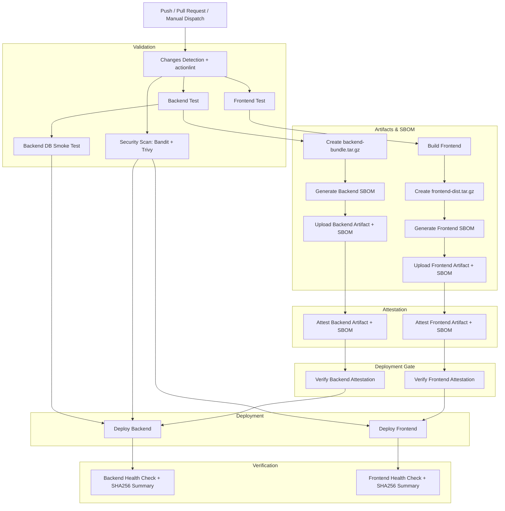

# CI/CD Security Hardening Implementation

## Overview

This document outlines the security improvements implemented in the AgriScan Pro CI/CD pipeline to enhance deployment security, reliability, supply-chain integrity, and operational visibility.

The current pipeline has been hardened with least-privilege GitHub permissions, AWS OIDC authentication, pinned GitHub Actions, production deployment gates, security scanning, artifact-based deployment for both frontend and backend, database smoke testing, dependency audit policy, and post-deploy health checks.

## Current Status

**Status:** Production-Grade Security Hardening Complete (SLSA Level 2-aligned / SLSA 2+ readiness)  
**Pending:** AWS IAM production role provisioning and Branch Protection rule activation  
**Last Updated:** 2026-04-29

### Current Remaining Items

| Priority | Item | Status |
|---|---|---|
| P0 | Confirm AWS IAM role trust policies and least-privilege deployment policies | Pending |
| P0 | Activate GitHub Branch Protection rules for `main` | Pending |
| P1 | Perform a manual verification of the first production attestation | Recommended |

---

## Production Readiness Checklist

Before enabling production deployment, confirm the following items:

| Area | Check | Status |
|---|---|---|
| GitHub Branch Protection | `main` requires pull request review before merge | Pending |
| GitHub Branch Protection | `main` requires CI checks before merge | Pending |
| GitHub Branch Protection | Direct push to `main` is restricted | Pending |
| GitHub Environment | `production` requires reviewer approval | Pending |
| GitHub Environment | Self-approval is disabled | Pending |
| GitHub Environment | Production secrets are stored as environment secrets | Pending |
| AWS IAM | Backend deployment role trust policy is restricted to the correct repo and branch | Pending |
| AWS IAM | Frontend deployment role trust policy is restricted to the correct repo and branch | Pending |
| AWS IAM | Backend role has least-privilege Elastic Beanstalk permissions | Pending |
| AWS IAM | Frontend role is scoped to one S3 bucket and one CloudFront distribution | Pending |
| Artifacts | Backend bundle includes required EB deployment files | Done |
| Artifacts | Frontend artifact is deployed without rebuild | Done |
| Security | Trivy fails on HIGH/CRITICAL findings | Done |
| Security | Bandit fails on high/critical findings | Done |
| Rollback | Backend rollback command has been tested | Pending |
| Rollback | Frontend rollback path has been tested | Pending |

---

## Implemented Security Measures

### 1. Least-Privilege GitHub Permissions

The workflow uses least-privilege permissions.

Top-level permissions are limited to:

```yaml
permissions:
  contents: read
```

Deployment and sensitive jobs receive specific, isolated permissions:

| Job Category | Permissions | Rationale |
|---|---|---|
| **Build/Test/Scan** | `contents: read` | Minimum access for standard CI operations |
| **Attestation** | `id-token: write`, `attestations: write` | Required for signing artifacts and SBOMs |
| **Verification** | `attestations: read` | Required for GitHub CLI provenance verification |
| **Cloud Deploy** | `id-token: write` | Required for AWS OIDC authentication |

This "Extreme Isolation" pattern prevents non-deployment jobs from requesting OIDC tokens and ensures that signing/verification happens in clean, minimal environments.

### 2. AWS OIDC Authentication

The pipeline uses AWS OpenID Connect authentication for deployments.

#### Implementation

Long-lived AWS credentials have been removed from the workflow. The deployment jobs assume AWS IAM roles through OIDC.

Backend deployment uses:
- `AWS_BACKEND_DEPLOY_ROLE_ARN`

Frontend deployment uses:
- `AWS_FRONTEND_DEPLOY_ROLE_ARN`

#### Benefits
- No long-lived AWS access keys stored in GitHub Secrets
- Short-lived AWS credentials issued per workflow run
- Better auditability through IAM role assumption
- Backend and frontend deployment permissions can be scoped separately
- Reduced blast radius if one deployment job is compromised

### 3. Production Environment Protection

Both deployment jobs use the GitHub production environment:

```yaml
environment:
  name: production
```

This enables GitHub Environment protection rules such as:
- Required reviewers
- Deployment approvals
- Environment-specific secrets
- Deployment audit trail
- Deployment branch restrictions

#### Recommended GitHub Environment Configuration

| Setting | Recommended Value |
|---|---|
| Environment name | production |
| Required reviewers | Enabled |
| Prevent self-review | Enabled |
| Deployment branches | main only |
| Environment secrets | AWS role ARNs, production host, S3 bucket, CloudFront distribution ID |

### 4. Branch Protection and Required Checks

The `main` branch should be protected to ensure that only validated changes can reach production.

Recommended branch protection settings:

| Setting | Recommended Value |
|---|---|
| Require pull request before merging | Enabled |
| Require approvals | At least 1 reviewer |
| Dismiss stale approvals | Enabled |
| Require status checks before merging | Enabled |
| Require branches to be up to date before merging | Enabled |
| Restrict who can push to matching branches | Enabled |
| Allow force pushes | Disabled |
| Allow deletions | Disabled |

Recommended required checks before merge:

```text
changes
backend-test
frontend-test
security-scan
backend-db-smoke-test
attest-backend
attest-frontend
```

Attestation verification occurs inside the production deployment verification jobs (`verify-backend-attestation` / `verify-frontend-attestation`).

### 6. Workflow Static Analysis (actionlint)

The pipeline uses `actionlint` to automatically detect syntax errors, unpinned actions, and security misconfigurations in GitHub Actions workflows.

#### Implementation
- **Tooling**: `actionlint-py` pinned to a specific version (`1.7.7.23`) in `backend/requirements-ci.txt`.
- **Enforcement**: Runs as part of the `changes` job on every push and PR.
- **Fail-Closed**: If the tool installation or linting fails, the entire pipeline is blocked.

### 7. Pinned GitHub Actions

GitHub Actions are pinned to full commit SHAs instead of mutable version tags.

This reduces supply-chain risk from mutable tags such as:
- `@v4`
- `@v5`
- `@master`

The workflow currently pins actions such as:
- `actions/checkout`
- `actions/setup-python`
- `actions/setup-node`
- `actions/upload-artifact`
- `actions/download-artifact`
- `dorny/paths-filter`
- `aws-actions/configure-aws-credentials`
- `aquasecurity/trivy-action`
- `github/codeql-action/upload-sarif`

#### Maintenance Requirement

Pinned action SHAs should be reviewed periodically and updated intentionally.

| Frequency | Task |
|---|---|
| Monthly | Check whether pinned actions have security updates |
| Monthly | Update SHAs deliberately through PR review |
| Every update | Verify the new SHA resolves to a real commit in the expected repository |

### 8. Hardened Checkout

Every checkout step uses:

```yaml
with:
  fetch-depth: 1
  persist-credentials: false
```

#### Benefits
- Avoids unnecessary full Git history fetch
- Prevents GitHub credentials from being persisted in local Git config
- Reduces token exposure risk during later shell commands
- Keeps checkout behavior consistent across jobs

### 9. Artifact-Based Deployment

Both frontend and backend now use artifact-based deployments to ensure consistency between testing and production.

#### 7.1 Frontend Artifact Deployment

The `frontend-test` job builds the frontend and uploads `frontend-dist`. The `deploy-frontend` job downloads this artifact and syncs it to S3.

The frontend deployment job does not rebuild the frontend and does not need to check out the repository.

#### Benefits
- Prevents build drift between CI and production
- Ensures the deployed frontend is the same artifact that passed lint, typecheck, smoke tests, dependency audit, and build
#### 7.2 Backend Artifact Deployment

The `backend-test` job creates a deployment archive: `backend-bundle.tar.gz`. This archive is uploaded as the `backend-bundle` artifact.

The `deploy-backend` job downloads and extracts this artifact before deploying to Elastic Beanstalk.

#### 7.3 Artifact Provenance and SLSA 2+ Readiness

AgriScan Pro implements **GitHub Artifact Attestations** to provide cryptographic proof of build integrity. This aligns with **SLSA Level 2** requirements for hosted build services and authenticated provenance (**SLSA Level 2-aligned / SLSA 2+ readiness**).

| Feature | Implementation | Security Value |
|---|---|---|
| **Provenance** | `actions/attest-build-provenance` | Proves the artifact was built by the authoritative workflow |
| **Integrity** | SHA256 Checksums | Detects any modification of the artifact after the build |
| **Visibility** | CycloneDX SBOM | Provides a machine-readable inventory of all dependencies |
| **Verification** | `gh attestation verify` | Blocks deployment of unverified or tampered artifacts |

The backend and frontend deployment artifacts are attested and verified before deployment. Their SBOMs are generated, uploaded, and attested as supply-chain evidence.

#### 7.4 Why tar.gz is Used

A tar archive is used instead of raw artifact directory upload because:
- Hidden deployment folders such as `.platform`, `.ebextensions`, and `.elasticbeanstalk` can be preserved
- File permissions for EB hook scripts can be preserved
- Sensitive and unnecessary files can be explicitly excluded
- Deployment uses the artifact from the tested workflow run rather than a fresh repository checkout

#### Excluded Backend Files

The backend bundle excludes sensitive and unnecessary files such as:
- `backend/.env`
- `backend/.env.*`
- `backend/.aws`
- `backend/.git`
- `backend/venv`
- `backend/.venv`
- `backend/**/__pycache__`
- `backend/**/*.pyc`
- `backend/**/tests/`
- `backend/**/test_*.py`
- `backend/db.sqlite3`
- `backend/logs`
- `backend/.logs_temp`
- `backend/.pytest_cache`

#### Important Validation

Before production rollout, confirm that excluding test files does not remove any runtime dependency. If production code imports test fixtures or test utilities, remove those test exclusions.

### 10. Frontend Public Configuration Uses GitHub Variables

Vite public environment variables now use GitHub repository variables instead of secrets:
- `VITE_API_BASE_URL`
- `VITE_MONITOR_URL`
- `FRONTEND_URL`

This is correct because `VITE_*` values are bundled into client-side JavaScript and are visible in the browser.

| GitHub Variables | GitHub Secrets |
|---|---|
| `VITE_API_BASE_URL` | `AWS_BACKEND_DEPLOY_ROLE_ARN` |
| `VITE_MONITOR_URL` | `AWS_FRONTEND_DEPLOY_ROLE_ARN` |
| `FRONTEND_URL` | `S3_FRONTEND_BUCKET` |
| | `CLOUDFRONT_DISTRIBUTION_ID` |
| | `PRODUCTION_HOST` |

`S3_FRONTEND_BUCKET`, `CLOUDFRONT_DISTRIBUTION_ID`, and `PRODUCTION_HOST` are not credentials by themselves, but keeping them as secrets can reduce infrastructure information disclosure. The primary security control remains IAM least privilege.

### 11. Security Scanning Pipeline

The workflow includes a dedicated `security-scan` job.

#### Tools
| Tool | Purpose |
|---|---|
| Bandit | Python static security analysis |
| Trivy | Filesystem and dependency vulnerability scanning |
| SARIF upload | Uploads results to GitHub Security tab |

#### Bandit Behavior

Bandit generates SARIF output: `bandit-results.sarif`. The workflow parses the SARIF file and fails if high/critical findings are detected as SARIF error level results.

#### Trivy Behavior

Trivy generates SARIF output: `trivy-results.sarif`. Trivy is configured with:
- `severity: 'HIGH,CRITICAL'`
- `exit-code: '1'`

This means HIGH or CRITICAL findings fail the pipeline.

#### SARIF Upload Guard

SARIF uploads are guarded to avoid permission failures on pull requests from external forks and to prevent failures if scan files are missing (e.g., if a previous step failed):

```yaml
if: (success() || failure()) && hashFiles('bandit-results.sarif') != '' && (github.event_name != 'pull_request' || github.event.pull_request.head.repo.full_name == github.repository)
```

This allows SARIF upload for internal PRs and pushes while avoiding write-permission failures on external fork PRs and missing-file errors.

### 12. Backend Database Smoke Test

The workflow includes a backend database smoke test using PostgreSQL. The PostgreSQL service image is pinned by digest:

```yaml
services:
  postgres:
    image: postgres@sha256:d0f363f8366fbc3f52d172c6e76bc27151c3d643b870e1062b4e8bfe65baf609
    ports:
      - 5432:5432
```

The job runs:
- Django database migrations
- Health endpoint validation
- Basic response-time observation

#### Current behavior:
- Non-200 health response fails the job.
- Response time above **500ms** triggers a hard failure (`SystemExit(1)`).
- This ensures that performance regressions are caught before they reach the deployment phase.

### 13. Dependency Audit Policy

Frontend dependency scanning uses `audit-ci` with a local policy file: `frontend/.audit-ci.json`.

The workflow runs:
```bash
npx --no-install audit-ci --config .audit-ci.json
```

#### Benefits
- Prevents runtime package downloads during CI
- Ensures `audit-ci` is locked in `frontend/package-lock.json`
- Allows policy-based vulnerability management
- Supports allowlists with justifications and expiry dates

#### Required Repository State

Confirm these files exist and are committed:
- `frontend/package.json`
- `frontend/package-lock.json`
- `frontend/.audit-ci.json` (Confirmed staged)

Confirm `audit-ci` exists in `frontend/devDependencies`.

#### Security Exception Policy

Any dependency allowlist entry must include the following fields in the justification or configuration:

| Field | Requirement |
|---|---|
| Advisory ID | Required |
| Package name | Required |
| Severity | Required |
| Reason | Required |
| Owner | Required |
| Expiry date | Required |
| Mitigation | Required |

Example entry for `.audit-ci.json`:

```json
{
  "advisories": {
    "GHSA-example-id": {
      "reason": "No patched version available; vulnerable code path is not used in production.",
      "owner": "backend/frontend owner",
      "expires": "2026-05-31",
      "mitigation": "Monitor upstream patch and remove allowlist after upgrade."
    }
  }
}
```

Expired allowlist entries must be removed or re-approved.

### 14. Post-Deploy Health Checks

Both backend and frontend deployments include post-deploy validation.

#### 12.1 Backend Health Check

The backend deploy job verifies: `https://${PRODUCTION_HOST}/health/`. It retries up to 30 times with a fixed 10-second delay.

It also attempts to validate: `/api/samples/`.

| Check | Failure Behavior |
|---|---|
| Missing `PRODUCTION_HOST` | Fails backend deploy |
| Backend `/health/` fails | Fails backend deploy |
| Backend `/api/samples/` fails | Warns only |

#### 12.2 Frontend Health Check

The frontend deploy job validates: `FRONTEND_URL`.

| Check | Failure Behavior |
|---|---|
| Missing `FRONTEND_URL` | Fails frontend deploy |
| Frontend URL fails | Fails frontend deploy |

### 15. Concurrency and Timeout Controls

The pipeline uses concurrency controls to avoid unsafe overlapping deployments.

#### Top-Level Concurrency
```yaml
concurrency:
  group: ci-${{ github.ref_name }}
  cancel-in-progress: ${{ github.event_name == 'pull_request' }}
```
This allows superseded pull request runs to be cancelled, but avoids cancelling production deploys triggered by pushes to main.

#### Production Deploy Concurrency
Deployment jobs use:
```yaml
concurrency:
  group: production-deploy
  cancel-in-progress: false
```
This prevents simultaneous production deployments and avoids interrupting an active deployment.

#### Job Timeouts
| Job | Timeout |
|---|---|
| changes | 10 minutes |
| backend-test | 25 minutes |
| frontend-test | 25 minutes |
| backend-db-smoke-test | 15 minutes |
| security-scan | 15 minutes |
| deploy-backend | 45 minutes |
| deploy-frontend | 30 minutes |

### 16. CloudFront Cache Optimization

The frontend deployment invalidates only `/index.html` instead of `/*`.

#### Rationale

Static frontend assets are expected to use hashed filenames and long-term cache headers: `public, max-age=31536000, immutable`.

The `index.html` file uses no-cache headers: `no-cache, no-store, must-revalidate`.

This allows browsers to fetch the latest HTML while continuing to cache immutable hashed assets efficiently.

### 17. Deployment Summaries

Deployment jobs write summaries to `$GITHUB_STEP_SUMMARY`.

#### Backend Summary Includes
- Artifact name
- **Artifact SHA256 Checksum**
- Commit SHA
- GitHub run ID
- GitHub run attempt
- Environment
- **Attestation Status (Passed)**
- Elastic Beanstalk environment name
- Backend health check status

#### Frontend Summary Includes
- Artifact name
- **Artifact SHA256 Checksum**
- Commit SHA
- GitHub run ID
- GitHub run attempt
- Environment
- **Attestation Status (Passed)**
- Frontend URL
- Timestamp
- Safe references to S3 and CloudFront configuration

The summaries avoid printing secret values directly.

---

## Pipeline Flow



---

## Required AWS IAM Setup

### 1. GitHub OIDC Provider

Create an OIDC provider for GitHub Actions.

```bash
aws iam create-open-id-connect-provider \
  --url https://token.actions.githubusercontent.com \
  --client-id-list sts.amazonaws.com \
  --thumbprint-list <github-oidc-thumbprint>
```

Verify the current GitHub OIDC thumbprint before applying this command.

### 2. Backend Deployment Role Trust Policy

Example trust policy:

```json
{
  "Version": "2012-10-17",
  "Statement": [
    {
      "Effect": "Allow",
      "Principal": {
        "Federated": "arn:aws:iam::ACCOUNT_ID:oidc-provider/token.actions.githubusercontent.com"
      },
      "Action": "sts:AssumeRoleWithWebIdentity",
      "Condition": {
        "StringEquals": {
          "token.actions.githubusercontent.com:aud": "sts.amazonaws.com"
        },
        "StringLike": {
          "token.actions.githubusercontent.com:sub": "repo:YOUR_ORG/YOUR_REPO:ref:refs/heads/main"
        }
      }
    }
  ]
}
```

#### Recommended Backend IAM Permissions

Avoid broad managed policies where possible. The backend deploy role should be scoped to:
- Specific Elastic Beanstalk application
- Specific Elastic Beanstalk environment
- Required S3 deployment artifact bucket
- Required CloudWatch Logs resources
- Any required EC2, Auto Scaling, and ELB permissions used by Elastic Beanstalk

Avoid unrestricted permissions such as `AWSElasticBeanstalkFullAccess`, `AmazonS3FullAccess`, or `CloudWatchLogsFullAccess` unless temporarily used during initial setup.

### 3. Frontend Deployment Role Trust Policy

Example trust policy:

```json
{
  "Version": "2012-10-17",
  "Statement": [
    {
      "Effect": "Allow",
      "Principal": {
        "Federated": "arn:aws:iam::ACCOUNT_ID:oidc-provider/token.actions.githubusercontent.com"
      },
      "Action": "sts:AssumeRoleWithWebIdentity",
      "Condition": {
        "StringEquals": {
          "token.actions.githubusercontent.com:aud": "sts.amazonaws.com"
        },
        "StringLike": {
          "token.actions.githubusercontent.com:sub": "repo:YOUR_ORG/YOUR_REPO:ref:refs/heads/main"
        }
      }
    }
  ]
}
```

#### Recommended Frontend IAM Permissions

The frontend deploy role should be limited to:

| Service | Actions |
|---|---|
| S3 | `s3:ListBucket`, `s3:PutObject`, `s3:DeleteObject` |
| CloudFront | `cloudfront:CreateInvalidation` |

Scope permissions to the specific frontend S3 bucket and CloudFront distribution.

### 4. AWS IAM Verification Checklist

Before production use, verify the following:

| Role | Check | Status |
|---|---|---|
| Backend role | Trust policy allows only the intended GitHub repository | Pending |
| Backend role | Trust policy allows only `refs/heads/main` or the intended production environment | Pending |
| Backend role | No wildcard admin policy is attached | Pending |
| Backend role | Elastic Beanstalk permissions are scoped to the target app/environment where possible | Pending |
| Backend role | S3 deployment artifact permissions are scoped to required buckets only | Pending |
| Frontend role | Trust policy allows only the intended GitHub repository | Pending |
| Frontend role | Trust policy allows only `refs/heads/main` or the intended production environment | Pending |
| Frontend role | S3 permissions are scoped to the frontend bucket only | Pending |
| Frontend role | CloudFront permission is scoped to the target distribution only | Pending |

---

## Required GitHub Secrets and Variables

### GitHub Secrets
Recommended location: GitHub Environment secrets under `production`.
- `AWS_BACKEND_DEPLOY_ROLE_ARN`
- `AWS_FRONTEND_DEPLOY_ROLE_ARN`
- `S3_FRONTEND_BUCKET`
- `CLOUDFRONT_DISTRIBUTION_ID`
- `PRODUCTION_HOST`

### GitHub Variables
Repository or environment variables:
- `VITE_API_BASE_URL`
- `VITE_MONITOR_URL`
- `FRONTEND_URL`

---

## Monitoring and Alerts

### Success Criteria
- Backend tests pass
- Backend deployment bundle is created and uploaded
- Frontend lint, typecheck, smoke test, dependency audit, and build pass
- Bandit scan has no high/critical findings
- Trivy scan has no HIGH/CRITICAL findings
- SARIF uploads complete for trusted runs
- Backend database smoke test passes
- Backend deploy completes successfully
- Backend health check passes within retry window
- Frontend deploy completes successfully
- Frontend URL check passes
- No overlapping production deployments occur

### Failure Scenarios
| Scenario | Result |
|---|---|
| Backend tests fail | Pipeline fails |
| Backend bundle creation fails | Pipeline fails |
| Frontend tests fail | Pipeline fails |
| `audit-ci` fails | Pipeline fails |
| Bandit high/critical findings | Pipeline fails |
| Trivy HIGH/CRITICAL findings | Pipeline fails |
| Backend DB smoke test fails | Backend deploy blocked |
| EB deploy fails | Backend deploy fails |
| Backend health check fails | Backend deploy fails |
| Frontend health check fails | Frontend deploy fails |

---

## Testing Strategy

### Local Testing
```bash
# Validate backend tests
cd backend
python manage.py test accounts.tests core.tests samples.tests

# Validate backend deploy smoke checks
bash -n .platform/hooks/predeploy/01_django_setup.sh
bash -n .platform/hooks/postdeploy/01_start_celery.sh
python manage.py check

# Validate Bandit locally
bandit -r backend/ --exclude backend/venv/,backend/migrations/

# Validate Trivy locally
trivy fs --severity HIGH,CRITICAL .

# Validate frontend audit policy
cd frontend
npx --no-install audit-ci --config .audit-ci.json

# Validate frontend
npm ci
npm run lint
npm run typecheck
npm run smoke
npm run build
```

### Artifact Validation

Before production rollout, validate backend artifact contents:
```bash
tar -tzf backend-bundle.tar.gz | head -100
tar -tzf backend-bundle.tar.gz | grep -E 'backend/(\.platform|\.ebextensions|\.elasticbeanstalk)' || true
tar -tzf backend-bundle.tar.gz | grep -E 'backend/\.env|backend/\.aws|backend/venv|backend/\.venv' && exit 1 || true
```

### Workflow Validation
Optional: test selected GitHub Actions jobs locally with `act`. OIDC, environment protection, SARIF uploads, and AWS deployment behavior should be validated in GitHub Actions itself.

---

## Rollback Procedures

### Backend Rollback
Elastic Beanstalk supports deployment version rollback through the AWS Console or EB CLI.
```bash
eb deploy Agriscanpro-backend-env --version <previous-version-label>
```

### Frontend Rollback
Manual rollback pattern:
```bash
aws s3 sync s3://backup-bucket/latest/ s3://frontend-bucket/
aws cloudfront create-invalidation --distribution-id $DIST_ID --paths "/index.html"
```
Avoid invalidating `/*` unless asset filenames or cache state require it.

---

## Future Enhancements

### Phase 2
- [ ] Add backend `pip-audit` policy or allowlist equivalent
- [ ] Add dependency allowlist expiry enforcement
- [ ] Store frontend deploy artifacts in versioned S3 backup path before sync
- [ ] Store backend deployment package version labels for easier rollback
- [ ] Convert response-time warning into performance regression gate if needed
- [ ] Add automated verification that backend bundle contains required EB hidden folders

### Phase 3
- [ ] Blue/green deployments
- [ ] Canary releases with traffic shifting
- [ ] Automated rollback based on CloudWatch metrics
- [ ] Multi-region deployment support
- [ ] Performance regression testing with historical baseline

---

## Security Compliance Mapping

### SOC 2 Alignment
| Control Area | Current Implementation |
|---|---|
| Least privilege access | GitHub permissions and AWS OIDC roles |
| Change management | PR-based CI, production environment gate, artifact-based releases |
| Auditability | GitHub Actions logs, deployment summaries, SARIF uploads |
| Vulnerability management | Bandit, Trivy, audit-ci |
| Availability | Health checks, deployment timeouts, concurrency controls |
| Secrets management | No long-lived AWS keys, environment secrets |

---

## Phase 2: Operational Hardening & Governance

### 2.2 Artifact Provenance & Verification

The pipeline uses artifact-based deployment to ensure the code tested is identical to the code deployed.

| Metadata | Source | Purpose |
|---|---|---|
| **Artifact Name** | `backend-bundle.tar.gz` / `frontend-dist` | Validates the correct package type |
| **Commit SHA** | `${{ github.sha }}` | Links the artifact to the specific source code |
| **Run ID** | `${{ github.run_id }}` | Tracks the specific execution that produced the artifact |
| **Environment** | `production` | Ensures the artifact is intended for the production environment |

Deployment summaries in GitHub Actions provide these identifiers for auditability.

### 2.3 Rollback Verification

Rollback is a critical recovery mechanism. Verification steps include:

1. **Backend Rollback**: Run `eb restore` or deploy a previous version via the pipeline.
2. **Frontend Rollback**: Re-upload the previous `frontend-dist` artifact to S3.
3. **Cache Invalidation**: Force a CloudFront invalidation for `/index.html` to point to the rolled-back version.
4. **Health Check**: Confirm the health check endpoint returns 200 OK and the expected application version.

#### Verification Commands

After rollback, verify:

```bash
# Backend
curl --fail --retry 5 --retry-delay 10 "https://${PRODUCTION_HOST}/health/"

# Frontend
curl --fail --retry 5 --retry-delay 10 "${FRONTEND_URL}"
```

Rollback is not considered complete until the relevant health check passes.

### 2.4 Emergency Deployment Policy

Emergency deployment bypass should be used only for production incidents.

Required controls:

| Control | Requirement |
|---|---|
| Approver | At least one production owner (Tech Lead or Security Officer) |
| Reason | Incident ID or written justification |
| Scope | Minimal change required to restore service |
| Follow-up | Post-incident review or retro |
| Audit | Link to workflow run and deployed commit SHA |

#### Constraints

Emergency deployments must not:
- Reintroduce long-lived AWS credentials
- Use mutable GitHub Action tags (@master, @v*)
- Skip health checks in the production environment

#### Logging

The rationale for the bypass must be documented in the corresponding GitHub Issue or Pull Request. A post-mortem must be conducted within 48 hours to address the root cause and restore the standard security posture.

## Maintenance

### Regular Tasks
| Frequency | Task |
|---|---|
| Monthly | Review pinned GitHub Action SHAs and update intentionally |
| Monthly | Review AWS IAM role permissions for least privilege |
| Monthly | Review `audit-ci` allowlist entries and expiry dates |
| Weekly | Review GitHub Security tab SARIF results |
| Weekly | Review dependency audit failures |
| Daily | Monitor deployment failures and pipeline duration |

### Alert Thresholds
| Alert | Threshold |
|---|---|
| Security scan failure | Immediate investigation |
| Deployment failure rate | More than 5% in a rolling 7-day window |
| Backend health check failure | Immediate investigation |
| Frontend health check failure | Immediate investigation |
| Response-time degradation | More than 10% sustained increase from baseline |

---

**Final Notes**

The CI/CD workflow is now fully hardened for production use. The highest-priority operational task is to complete and verify AWS IAM setup. After IAM trust policies and least-privilege permissions are confirmed, the pipeline is ready for production deployment.
